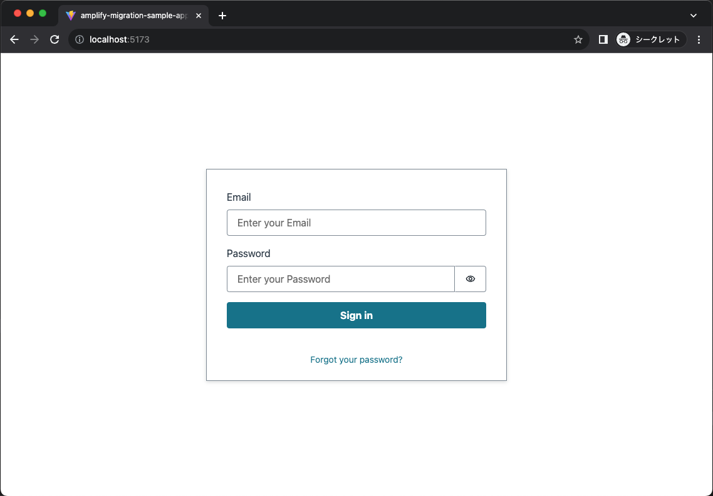

# amplify-migration-sample-app

Cognito のログイン画面を持つフロントエンドウェブアプリケーションです。Amplify ライブラリを利用してバックエンド API と連携します。




## 全体のディレクトリ構成

```
.
├── cdk          // バックエンド (API Gateway + lambda) の実装
├── src          // フロントエンドの実装
│   ├── App.tsx  // メインページ
│   └── main.tsx // index.html で最初に読み込まれるファイル Amplify.configure を実装
└── README.md    // 本ドキュメント
```

## API Gateway, Lambda, Cognito のデプロイ

サンプルアプリで利用するサービスをデプロイします。

**NOTE**: デプロイする前に下記の手順に従っていくつかの準備を行なってください。

- [AWS CLI のインストール](https://docs.aws.amazon.com/ja_jp/cli/latest/userguide/install-cliv2.html) および [認証情報の設定](https://docs.aws.amazon.com/ja_jp/cli/latest/userguide/cli-configure-files.html)
  - Administrator 相当の権限を設定してください。
- [Node.js LTS](https://nodejs.org/en/) のインストール

CDK のセットアップをします。この作業は、リージョンで初めて CDK デプロイを実行する際に必要になります。

```bash
npm run cdk bootstrap
```

以上の準備が整ったら `cdk` ディレクトリに移動し、下記コマンドを実行してデプロイを行います。

```bash
cd cdk
npm run cdk deploy
```

デプロイの途中で `Do you wish to deploy these changes (y/n)?`と出力されたら、y を入力してエンターキーを押して進んでください。

数十秒でデプロイが完了します。デプロイが完了すると下記の通り API Gateway のエンドポイントや Cognito ユーザープールの ID 等が表示されますので、次の手順で利用するためメモしておいてください。

```bash
✨  Deployment time: 37.77s

Outputs:
CdkStack.RestApiEndpoint0551178A = https://xxx.execute-api.ap-northeast-1.amazonaws.com/prod/
CdkStack.identityPoolId = ap-northeast-1:xxx
CdkStack.userPoolClientId = xxx
CdkStack.userPoolId = ap-northeast-1_xxx
```

## Cognito ユーザー追加

Cognito ユーザープールでじユーザーを作成します。AWS CLI を使う場合は以下のコマンドを実行して `test@example.com` というユーザーを作成できます。

```bash
aws cognito-idp admin-create-user \
--user-pool-id "ap-northeast-1_xxx" \
--username "test@example.com" \
--user-attributes Name=email,Value="test@example.com" Name=email_verified,Value=true \
--temporary-password Pass123!
--message-action SUPPRESS
```

## フロントエンド起動

`src/main.tsx` を開き、前の手順でコピーした値を使って下記を設定します。

```typescript
Amplify.configure({
  Auth: {
    identityPoolId: 'ap-northeast-1:xxx',
    region: 'ap-northeast-1',
    userPoolId: 'ap-northeast-1_xxx',
    userPoolWebClientId: 'xxx',
  },
  API: {
    endpoints: [
      {
        name: 'restApi',
        endpoint: 'https://xxx.execute-api.ap-northeast-1.amazonaws.com/prod/',
        region: 'ap-northeast-1',
      },
    ],
  },
});
```

編集後、ルートディレクトリに戻り、下記の通りローカルでフロントエンドを起動します。

```bash
cd ..
npm ci
npm run dev
```

##　デプロイしたサービスの削除

下記コマンドを実行して削除します。

```bash
npm run cdk destroy
```
